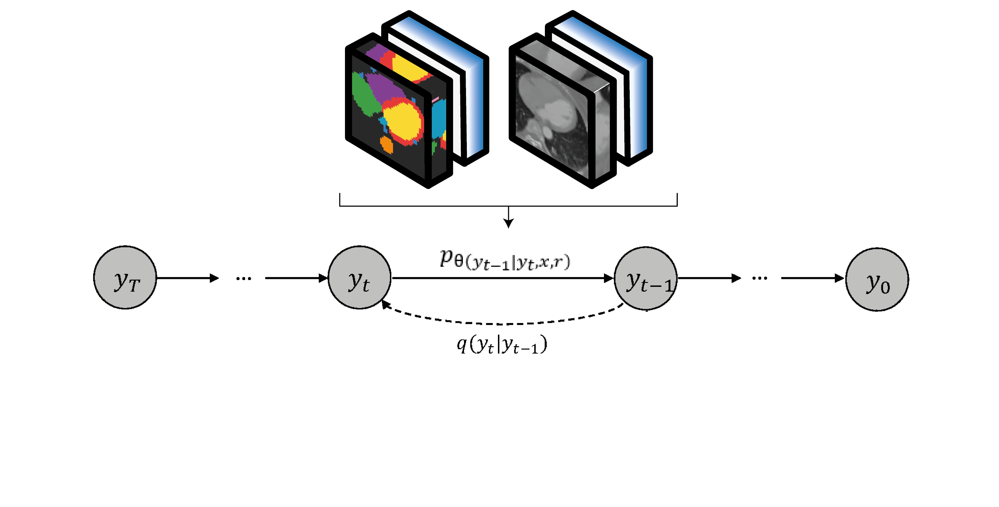

# High-Resolution CTCA Image Synthesis with Patched Semantically Conditioned Diffusion Models

&nbsp;



&nbsp;

### [Baseline Paper](https://arxiv.org/abs/2207.00050)

[Weilun Wang](https://scholar.google.com/citations?hl=zh-CN&user=YfV4aCQAAAAJ), [Jianmin Bao](https://scholar.google.com/citations?hl=zh-CN&user=hjwvkYUAAAAJ), [Wengang Zhou](https://scholar.google.com/citations?hl=zh-CN&user=8s1JF8YAAAAJ), [Dongdong Chen](https://scholar.google.com/citations?hl=zh-CN&user=sYKpKqEAAAAJ), [Dong Chen](https://scholar.google.com/citations?hl=zh-CN&user=_fKSYOwAAAAJ), [Lu Yuan](https://scholar.google.com/citations?hl=zh-CN&user=k9TsUVsAAAAJ), [Houqiang Li](https://scholar.google.com/citations?hl=zh-CN&user=7sFMIKoAAAAJ),

## Overview

This research project is focused on generating synthetic computed tomography coronary angiography (CTCA) images with a patched, semantically conditioned diffusion model. By conditioning image generation on semantic maps, we ensure that the synthetic outputs maintain topological accuracy, closely mirroring the vascular structures observed in real CTCA scans. Additionally, patched synthesis allows this method to be scalable, generating high resolution results regardless of hardware limitations. This approach solves some the issues related with the use of medical data in AI such as scarcity, limited resolution and patient privacy concerns.


## Example Results
* **ImageCAS Dataset Low Resolution (64x64x64):**

<p align='center'>  
  
</p>

* **ImageCAS Dataset High Resolution (128x128x128):**

<p align='center'>  
  
</p>


## Prerequisites
- Linux
- Python 3
- CPU or NVIDIA GPU + CUDA CuDNN

## Dataset Preparation
The ImageCAS dataset can be downloaded [ImageCAS](https://github.com/XiaoweiXu/ImageCAS-A-Large-Scale-Dataset-and-Benchmark-for-Coronary-Artery-Segmentation-based-on-CT.git).

The original data needs to be preprocessed:
0. For our implementation complete heart labels were obtained using [Totalsegmentator](https://totalsegmentator.com/), and joined together with the coronary labels provided by ImageCAS
1. Data should be resampled, reshaped and sliced to the desired size, using utils/resample_data.py 
2. For the HR model, references need to be created using utils/resample_data.py w/ --ref True

The folder structure should be as follows:
#### Low Resolution Data
    .
    ImageCAS
    ├── cta_processed
        ├── training
        ├── validation
    ├── annotation_processed
        ├── training
        ├── validation 
#### High Resolution Data
    .
    ImageCAS
    ├── cta_processed_hr
        ├── training
        ├── validation
    ├── annotation_processed_hr
        ├── training
        ├── validation
    ├── cta_reference
        ├── training
        ├── validation

### Training and Test

- Train the Low Resolution SDM model:
```bash
ml cuda  # load default CUDA module

python image_train.py --data_dir /home/data/imagecas/ --dataset_mode nifti --lr 1e-4 --batch_size 1 --attention_resolutions 16,8 --diffusion_steps 1000 --image_size 64 --learn_sigma True --noise_schedule cosine --num_channels 128 --num_head_channels 64 --num_res_blocks 2 --resblock_updown True --use_fp16 True --use_scale_shift_norm True --use_checkpoint True --num_classes 9 --class_cond True --no_instance True --lr_anneal_steps 20000

ml -cuda  # unload all modules
```

- Train the High Resolution SDM model:
```bash
ml cuda  # load default CUDA module

python image_train.py --data_dir /home/data/imagecas/ --dataset_mode nifti_hr --lr 1e-4 --batch_size 1 --attention_resolutions 16,8 --diffusion_steps 1000 --image_size 128 --learn_sigma True --noise_schedule cosine --num_channels 128 --num_head_channels 64 --num_res_blocks 2 --resblock_updown True --use_fp16 True --use_scale_shift_norm True --use_checkpoint False --num_classes 9 --class_cond True --no_instance True --lr_anneal_steps 40000 --reference True --pos_emb True

ml -cuda  # unload all modules
```

- Fine-tune the model:
```bash
ml cuda

python image_train.py --data_dir /home/data/imagecas/ --dataset_mode nifti --lr 1e-4 --batch_size 1 --attention_resolutions 16,8 --diffusion_steps 1000 --image_size 64 --learn_sigma True --noise_schedule cosine --num_channels 128 --num_head_channels 64 --num_res_blocks 2 --resblock_updown True --use_fp16 True --use_scale_shift_norm True --use_checkpoint True --num_classes 9 --class_cond True --no_instance True --lr_anneal_steps 40000 --drop_rate 0.2 --resume_checkpoint ./logs/model_folder/model020000.pt

ml -cuda
```

- Test the High Resolution SDM model:
```bash
ml cuda

python image_sample.py --data_dir /home/data/imagecas/ --batch_size 1 --dataset_mode nifti --attention_resolutions 16,8 --diffusion_steps 1000 --image_size 64 --learn_sigma True --noise_schedule cosine --num_channels 128 --num_head_channels 64 --num_res_blocks 2 --resblock_updown True --use_fp16 True --use_scale_shift_norm True  --num_classes 9 --class_cond True --no_instance True --num_samples 1 --s 1 --model_path ./logs/model_folder/model040000.pt --results_path ./results/results_name --history False --reference True --pos_emb True

ml -cuda
```

- Test the High Resolution SDM model:
```bash
ml cuda

python image_sample.py --data_dir /home/data/imagecas/ --batch_size 8 --dataset_mode nifti_hr --attention_resolutions 16,8 --diffusion_steps 1000 --image_size 128 --learn_sigma True --noise_schedule cosine --num_channels 128 --num_head_channels 64 --num_res_blocks 2 --resblock_updown True --use_fp16 True --use_scale_shift_norm True  --num_classes 9 --class_cond True --no_instance True --num_samples 8 --s 1 --model_path ./logs/model_folder/model040000.pt --results_path ./results/results_name --history False --reference True --pos_emb True

ml -cuda
```

